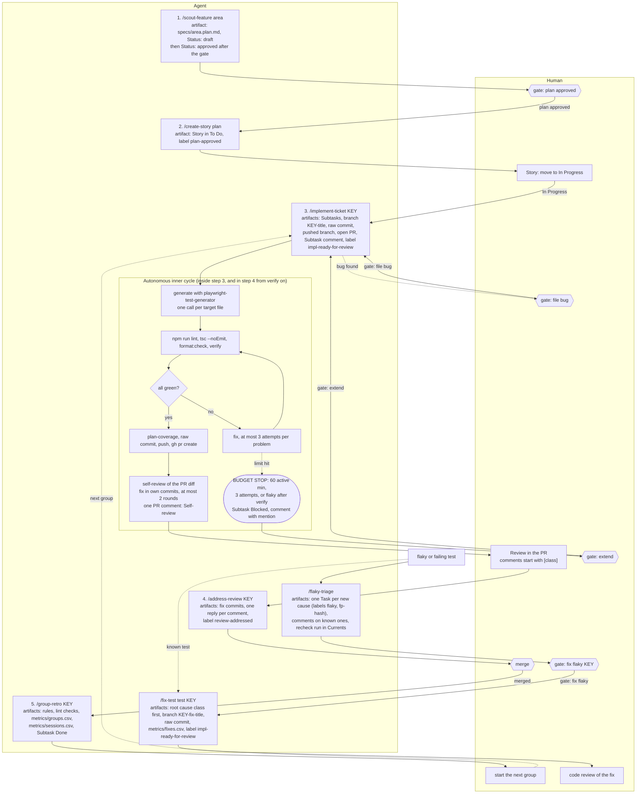
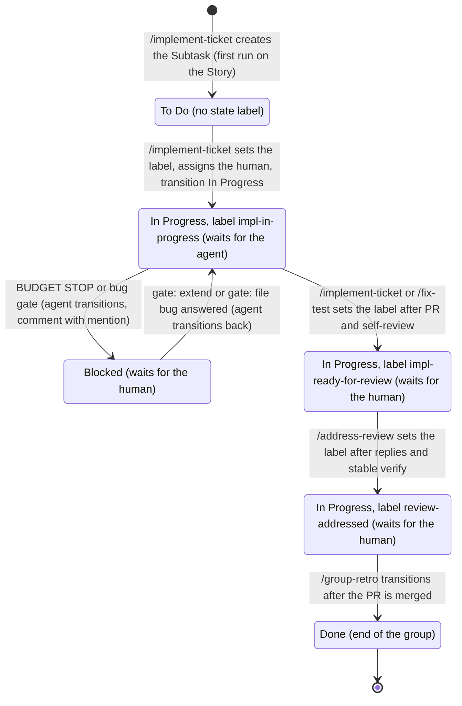

# Loop map

A one-page map of the agent loop. Sources of truth: `CLAUDE.md`, `.claude/loop-rules.md`, `.claude/commands/*.md`,
`specs/agentic-qa-loop-v2.plan.md`, `scripts/jira-ticket.mjs`, `scripts/jira-common.mjs`, `git log main`. If this file and
those disagree, those win; fix this file in the same commit as the change.

## 1. The loop by lane

What each step leaves behind:

| Step | Command             | Artifacts                                                                                                      | Human gate after      |
| ---- | ------------------- | -------------------------------------------------------------------------------------------------------------- | --------------------- |
| 1    | `/scout-feature`    | `specs/<area>.plan.md` (`Status: draft`, then `approved <date>`), feature inventory, reuse map, go/no-go       | `gate: plan approved` |
| 2    | `/create-story`     | Story in To Do (template `specs/templates/story.md`), label `plan-approved`                                    | Story to In Progress  |
| 3    | `/implement-ticket` | Subtasks (first run), branch `<KEY>-<title>`, raw commit, PR, self-review, `verify` report                     | review in the PR      |
| 4    | `/address-review`   | fix commits, replies, label `review-addressed`                                                                 | merge                 |
| 5    | `/group-retro`      | rules, ESLint checks, `metrics/groups.csv` row, `metrics/sessions.csv` rows, Subtask `Done`                    | next group            |
| F    | `/flaky-triage`     | Task per root cause (labels `flaky`, `fp-<hash>`), comments on known causes, recheck run (`flaky-recheck.yml`) | `gate: fix flaky`     |
| M    | `/fix-test`         | root cause class, fix on a `ZED-N` branch, `metrics/fixes.csv` row                                             | code review           |

Notes:

- A session ends at a gate; the next step is a new session. Nothing is triggered by a status change; each command checks the
  ticket state itself (`jira-ticket.mjs gate`) and refuses to start otherwise.
- The agent pushes the ticket branch and opens the PR; the merge, and anything else on GitHub, is the human's.
- `/group-retro` changes files but does not commit; it ends with a `git add` + `git commit` block.

## 2. Subtask states

Status in Jira, state label, and who the ticket waits for. "Waits for" for labels comes from `LOOP_STATE_LABELS` in
`scripts/jira-common.mjs`.

- The agent moves a Subtask only to `In Progress`, `Blocked` or `Done` (`SUBTASK_STATUSES` in `scripts/jira-ticket.mjs`). The
  state labels move on their own track: one at a time, set with `jira-ticket.mjs label`.
- **Story:** the plan gate (`To Do` to `In Progress`) and every other status are the human's. The agent moves a Story only to
  `Done`, and only when every Subtask is `Done` (`/group-retro`). `transition` refuses anything else.
- **Bug:** the status is always the human's; `transition` refuses it. A bug that was not reproduced gets `needs-manual-repro`.
- Story labels: `plan-approved` is set by `/create-story`; the Story's `In Progress` is the human's move.

## 3. Change log of the control logic

One line per decision. Dates are commit dates on `main` unless noted.

| Date                               | What changed                                                                                                                                          | Why                                                                                                                             | Files                                                                                                                                                                                 |
| ---------------------------------- | ----------------------------------------------------------------------------------------------------------------------------------------------------- | ------------------------------------------------------------------------------------------------------------------------------- | ------------------------------------------------------------------------------------------------------------------------------------------------------------------------------------- |
| 2026-09-28                         | v1 plan: Currents, Jira triage and repro stages for the wallpapers area (stages 1-5)                                                                  | First iteration of the agentic QA loop; kept as a record and not rewritten                                                      | `specs/agentic-qa-loop.plan.md` (`0fcb681`)                                                                                                                                           |
| 2026-10-01                         | v1 to v2: from a one-off pipeline to a reusable measured loop with six commands, gates, Subtasks per group, v2 (ringtones) and v3 (replay)            | v1 gave totals only, not per task; v2 makes every task measurable and the loop reusable                                         | `specs/agentic-qa-loop-v2.plan.md` (`db09f6b`), `.claude/commands/*`, `.claude/loop-rules.md` (`ae0326d`)                                                                             |
| 2026-10-01                         | Stage 8 dry run finding 1: `jira-ticket.mjs show` returns description and comments                                                                    | `/implement-ticket` could not read the groups                                                                                   | `scripts/jira-ticket.mjs` (`b1a4cdd`)                                                                                                                                                 |
| 2026-10-01                         | Stage 8 dry run finding 2: `allowed-tools` applies to the command's own turn only; a follow-up turn needs tools passed again                          | Learned in the dry run; headless runs pass `--allowedTools`                                                                     | `specs/agentic-qa-loop-v2.plan.md` (`4e4bf18`)                                                                                                                                        |
| 2026-10-01                         | Stage 8 dry run finding 3: a dirty working tree makes `/implement-ticket` stop without touching Jira                                                  | Works as designed; recorded                                                                                                     | `.claude/commands/implement-ticket.md`, plan (`4e4bf18`)                                                                                                                              |
| 2026-10-01                         | Stage 8 dry run finding 4: the generator agent has no shell; the main session runs lint, tsc and `verify` and takes over a failed spec                | The agent cannot run the spec it writes; "main session took over" is recorded as a result                                       | `.claude/agents/`, plan (`4e4bf18`)                                                                                                                                                   |
| 2026-10-01                         | Stage 8 dry run finding 5: `/group-retro` turned 6 findings into 3 CLAUDE.md lines and 2 ESLint rules; `loop-metrics` needs `<merge>^2`               | First real retro; some metrics stay empty (no `gh run` permission, no Story label history)                                      | `CLAUDE.md`, `eslint.config.js`, `metrics/groups.csv` (`4e4bf18`)                                                                                                                     |
| 2026-10-01                         | Stage 8 dry run finding 6: follow-ups from `claude -p --resume` are not tagged as human messages, so gates and interventions read 0                   | Headless artefact; real windows tag them                                                                                        | plan (`4e4bf18`)                                                                                                                                                                      |
| 2026-10-01                         | Stage 8 dry run finding 7: `/group-retro` cannot edit `.claude/commands/*`; command changes need the human                                            | Permission boundary found in the dry run                                                                                        | plan (`4e4bf18`)                                                                                                                                                                      |
| 2026-10-01                         | Retro rules: components for repeating page parts, settled counts instead of one-shot `count()`, no `if (...) return` guards in `pages/<area>/`        | Each class of PR #1 findings became one rule or one ESLint check (`/group-retro`, L-07)                                         | `CLAUDE.md`, `eslint.config.js` (`4e4bf18`)                                                                                                                                           |
| 2026-10-01                         | Shared helper instead of a copy: one `pages/CardLinkValidator.ts` parameterised by the difference, old code switched, smoke re-run                    | A card validator copied for ringtones was a `[dup-pom]` risk; "defer to a later group" is not allowed                           | `pages/CardLinkValidator.ts` (`4b00493`), `CLAUDE.md` (`4e4bf18`)                                                                                                                     |
| 2026-10-01                         | Review comment prefixes: only the seven classes count, anything else is `unclassified`; use `[other]` when none fits                                  | PR #1: 3 of 6 findings came back `unclassified`                                                                                 | `specs/agentic-qa-loop-v2.plan.md` (`034773f`), `.claude/loop-rules.md`                                                                                                               |
| 2026-10-04 (plan text: 2026-10-01) | Autonomy: the agent pushes the branch and opens the PR, self-reviews it (2 rounds), assigns the human, moves Subtasks, and @mentions only when needed | The human reviews in the PR, not in the working tree; fewer manual steps between gates; Story and Bug statuses stay human       | `.claude/commands/implement-ticket.md`, `address-review.md`, `group-retro.md`, `.claude/loop-rules.md`, `CLAUDE.md`, `scripts/jira-common.mjs`, `scripts/jira-ticket.mjs` (`e4f3647`) |
| 2026-10-04                         | Every PR is squash-merged; `/group-retro` measures up to the branch tip, not the merge commit                                                         | One commit per group on `main`; a squash hides the branch commits, so `loop-metrics` needs the tip (its header already says so) | `CLAUDE.md`, `.claude/loop-rules.md`, `.claude/commands/group-retro.md`                                                                                                               |

| 2026-10-05 | `/flaky-triage` and `flaky-recheck.yml` (draft): Currents failures grouped by cause, rechecked, one Task per cause, `gate: fix flaky` before `/fix-test`; `@FLAKY:<KEY>` tag | Two CI failures (WP-07, WP-08) showed the need; Currents shows no flaky with `retries: 0` |

## Not confirmed and out of sync

- Not confirmed from the files: what happens to the state label while a Subtask is `Blocked` (no file says it is changed or kept).
  No command lists the `Blocked` to `In Progress` move as a numbered step; only `loop-rules.md` says it. `plan-draft` is in
  `LOOP_STATE_LABELS` but no command sets it. The step-4 loop (fix, lint/tsc/verify) is drawn from `/address-review` step 5 and
  has no self-review round in the file.
- Out of sync: the autonomy decision is dated 2026-10-01 in the plan text, but `e4f3647` is from 2026-10-04. The plan's `## Status`
  checklist has every stage unchecked while most Stage 6-8 bullets are checked.
